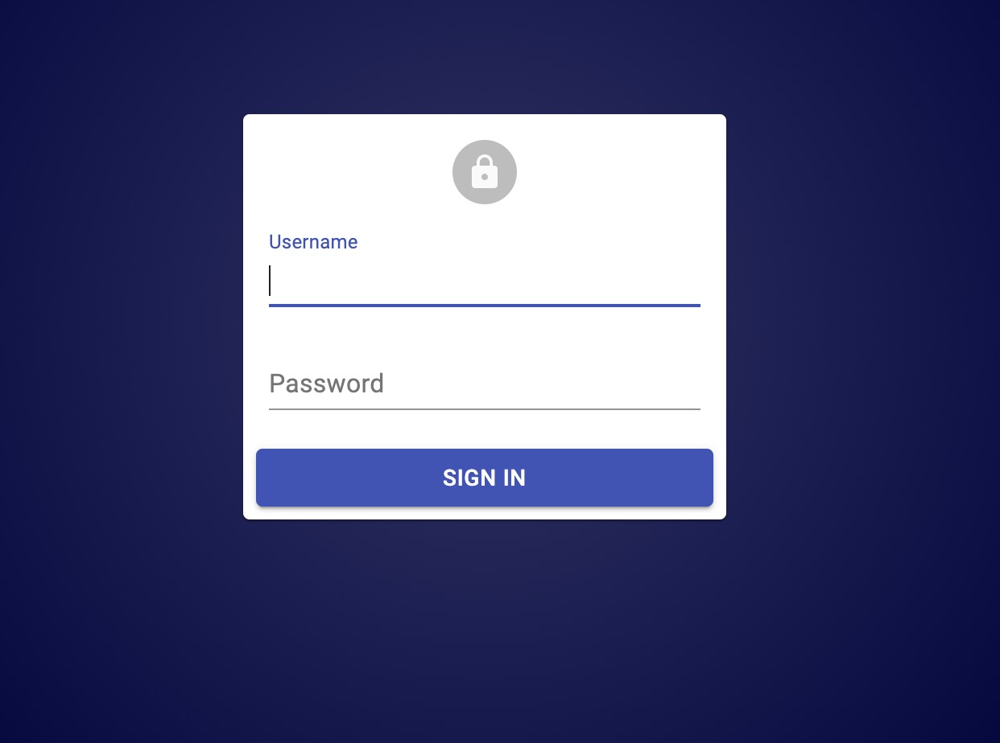
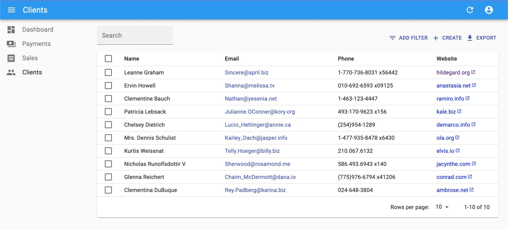
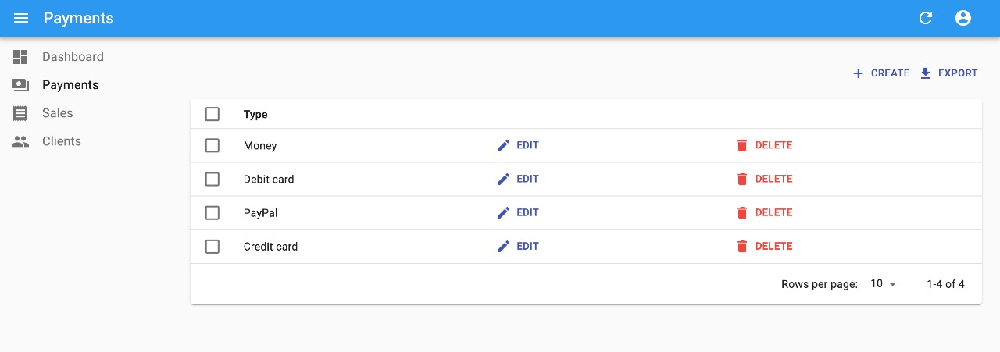
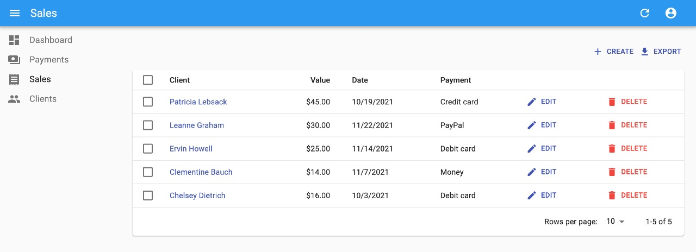
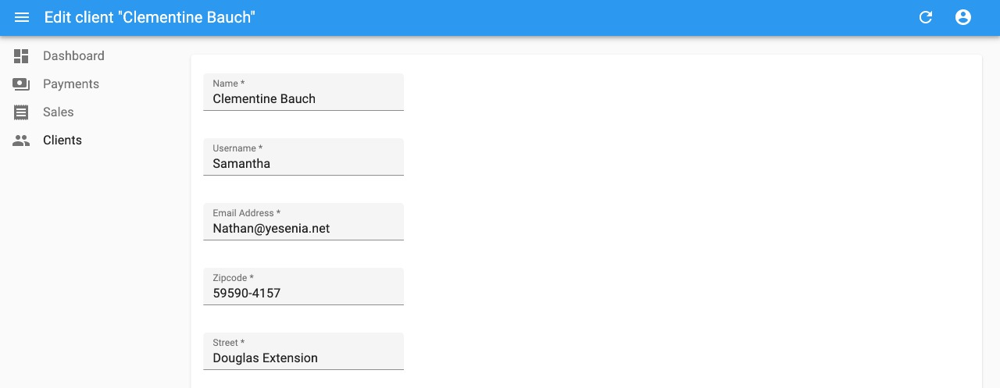
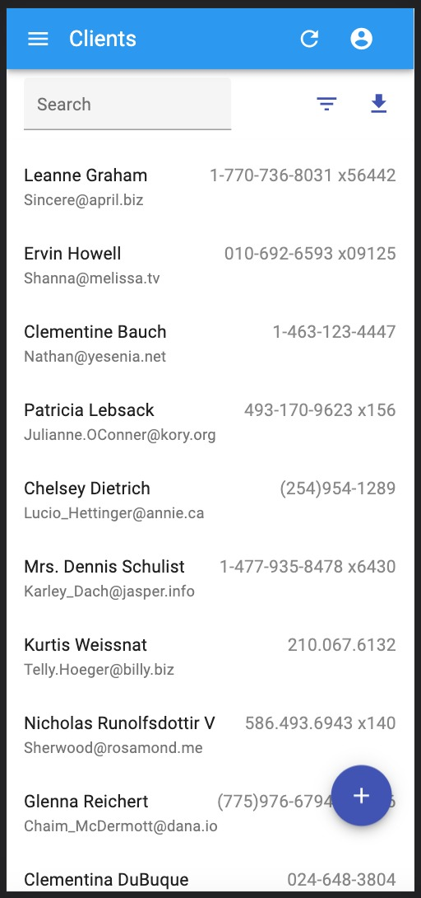
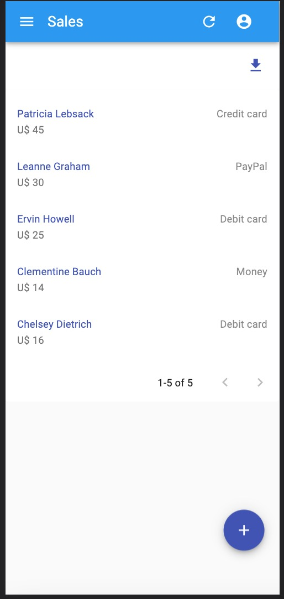

# Small application to study react-admin

See my React-admin summary [here](https://prism-rotate-8b8.notion.site/React-admin-c570ba316bd24a7a964c9546498f3c3a).

## Next Steps

- Rewrite the project in TypeScript.
- Create authentication and authorization logic.

## API

[This](https://my-json-server.typicode.com/JulianaBurzlaff/data) is my fake API to show the data. With this API it is not possible to make changes and inserts of data, but you can create your own JSON file for that.

## Images

Check some screenshots of the application's interface!

